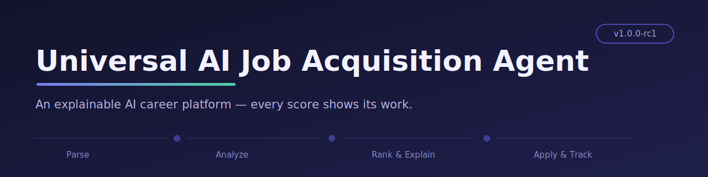
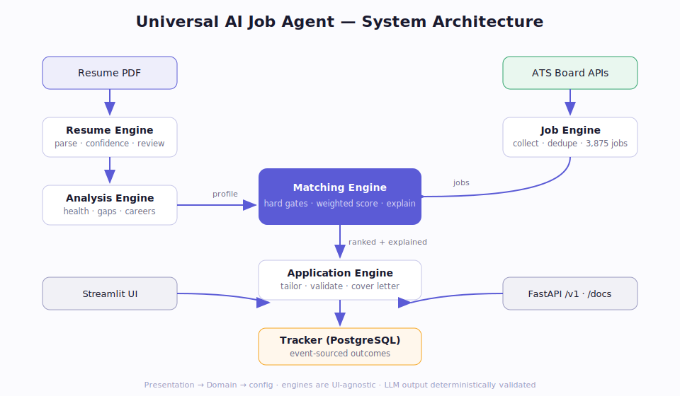
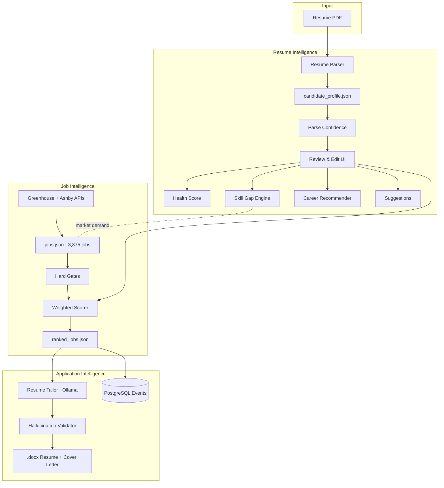

<div align="center">



# 🎯 Universal AI Job Acquisition Agent

**An AI career-intelligence platform that parses your resume, scores it honestly, finds your skill gaps from real market data, and ranks thousands of real jobs against your actual profile — with every score explainable.**

[](CHANGELOG.md)
[](https://www.python.org/)
[](LICENSE)
[](https://streamlit.io/)
[](https://www.postgresql.org/)
[](https://ollama.com/)
[](CONTRIBUTING.md)

[Features](#-features) · [Architecture](#-architecture) · [Installation](#-installation) · [Results](#-results) · [Roadmap](#-roadmap) · [Docs](docs/)

</div>

---

## 📖 Table of Contents

- [The Problem](#-the-problem)
- [The Solution](#-the-solution)
- [Features](#-features)
- [Design Principles](#-design-principles)
- [Architecture](#-architecture)
- [Screenshots](#-screenshots)
- [Installation](#-installation)
- [Running the Project](#-running-the-project)
- [Example Output](#-example-output)
- [Results](#-results)
- [Project Structure](#-project-structure)
- [Technologies](#-technologies)
- [Roadmap](#-roadmap)
- [Contributing](#-contributing)
- [License](#-license)
- [Contact](#-contact)

---

## 🔥 The Problem

Job searching is broken. Candidates manually search a dozen portals with inconsistent filters, apply blindly to low-probability roles, get silently rejected by ATS parsers, and never learn *why*. There is no unified intelligence layer that understands the candidate's profile, the market, and the gap between them.

## 💡 The Solution

A single pipeline that acts as an **AI career coach**, not a job board:

```
Upload Resume → Review Extraction → Resume Intelligence → Job Intelligence → Application Intelligence
```

It understands the candidate first (health score, skill gaps, career fit), then ranks real jobs from legal ATS sources against that understanding — and explains every number it shows.

## ✨ Features

**Resume Intelligence**
- PDF resume parsing: contact, links, education, skills, projects → structured `candidate_profile.json`
- **Parse-confidence scoring** — the app tells you *how much to trust its own parser*, per section, and lets you review and edit everything before analysis runs
- **Resume Health Score (0–100)** across six explainable dimensions: contact, skills, projects, quantified impact, education, ATS-readiness — deterministic, no LLM, identical on every run
- Evidence-backed suggestions that quote your actual bullets, not generic advice

**Job Intelligence**
- Legal job sourcing from **Greenhouse and Ashby ATS board APIs** (no ToS-violating scraping) — 3,875 deduplicated real jobs in the current corpus
- Hard gates that *remove* (never just down-rank): irrelevant titles, >3 years strictly required, security clearance, no-sponsorship postings
- Structured requirement extraction: required vs. preferred years, clearance, sponsorship language

**Matching & Ranking**
- Weighted score: `0.40·skill_overlap + 0.30·semantic + 0.20·role + 0.10·seniority`
- Two-layer skill matching: exact/alias (RAG ↔ Retrieval-Augmented Generation, full credit) and category-level (CLIP → "vision-language model", 0.6 partial credit)
- **Explainable output:** strong matches, likely matches, and missing skills for every job

**Career Intelligence**
- Career-path fit scoring with visible evidence ("✓ You have: llm, rag, faiss…") and what's missing to strengthen each fit
- **Market-driven skill gaps:** the impact of a missing skill = the share of *your actual job corpus* mentioning it — weighted by your target roles, with a statistical honesty guard that refuses to headline percentages computed from too few jobs

**Application Intelligence**
- **One-click, in-app resume tailoring** from any job card: JD analysis → LLM rewrite → validation → downloadable ATS-safe `.docx`, with a per-project truthfulness report
- **Deterministic hallucination validator:** every tailored bullet is checked against the original resume; fabricated tools or metrics are flagged and the project falls back to truthful originals
- Cover letter generation (in-app, with inline preview) behind the same truthfulness gate
- **Dual LLM backend, auto-selected:** Ollama/Mistral locally (fully private), Groq `llama-3.3-70b-versatile` in deployment — same prompts, same validator either way
- **Application Tracker:** event-sourced pipeline (saved → applied → interview → offer) with notes and timelines; every event snapshots the match score — the training data for future learning-to-rank

## 🧭 Design Principles

1. **Explainable over impressive.** Every score decomposes into visible sub-scores and findings.
2. **Honest numbers only.** Skill-gap demand comes from the collected corpus, not invented "+15%" claims. When a sample is too small to trust, the UI says so.
3. **Truthfulness is enforced, not requested.** The LLM is *asked* not to fabricate — and then a deterministic validator *verifies* it didn't.
4. **Legal sourcing only.** ATS board APIs, not scraping LinkedIn/Indeed/Naukri.
5. **Analysis logic is UI-agnostic.** `backend/analysis/` is pure functions — the Streamlit app renders them today; a FastAPI service can expose them tomorrow with zero rewrite.

## 🏗 Architecture



<details>
<summary>Detailed pipeline view (Mermaid)</summary>



</details>

Full architecture documentation with sequence, component, and data-flow diagrams: **[docs/ARCHITECTURE.md](docs/ARCHITECTURE.md)**

## 📸 Screenshots

<!-- Replace placeholders with real captures — see assets/README.md for the shot list and captions -->

| Landing (upload-first) | Review & Edit extraction |
|---|---|
|  |  |

| Resume Intelligence Dashboard | Ranked Jobs |
|---|---|
|  |  |

<!-- Demo GIF placeholder: assets/demo.gif (record: upload → review → dashboard → jobs) -->

## ⚙️ Installation

### Fastest: Docker (full stack, one command)

```bash
git clone https://github.com/Stevemeg/universal-ai-job-agent.git
cd universal-ai-job-agent
docker compose up --build
# UI: http://localhost:8501 · API docs: http://localhost:8000/docs
```

No job corpus yet? Start with the bundled 120-job sample, then collect the full corpus later:

```bash
cp data/sample_jobs.json data/jobs.json
```

### Manual setup

**Requirements:** Python 3.11 · Node.js ≥ 18 · Docker Desktop (for outcome logging) · [Ollama](https://ollama.com) with `mistral` (for tailoring/cover letters)

```bash
git clone https://github.com/Stevemeg/universal-ai-job-agent.git
cd universal-ai-job-agent

python -m venv venv
# Windows: .\venv\Scripts\Activate.ps1   |   Linux/macOS: source venv/bin/activate
pip install -r requirements.txt

# Optional components
ollama pull mistral                      # resume tailoring + cover letters
cd backend/database && docker compose up -d && cd ../..   # outcome logging
```

## 🚀 Running the Project

Always run from the project root.

```bash
# 1. Collect jobs (Greenhouse + Ashby)
python -m backend.job_scraper.ats_collector
python -m backend.job_scraper.dedupe_jobs

# 2. Rank jobs against your profile (saves data/ranked_jobs.json)
python -m backend.job_scraper.run_real_ranking          # add --log to record impressions in Postgres

# 3. Launch the app
streamlit run backend/ui/app.py

# 3b. Or run the REST API (interactive docs at /docs)
uvicorn backend.api.app:app --reload

# 4. Tailor resumes / cover letters — use the in-app buttons on any job card,
#    or the CLI equivalents:
python -m backend.resume_engine.resume_tailor --rank 1
python -m backend.resume_engine.cover_letter --rank 1
#    LLM backend auto-selects: Ollama locally (`ollama serve`), or Groq when
#    GROQ_API_KEY is configured — see CONFIGURATION.md

# 5. Track applications — in-app Tracker tab, or the CLI:
python -m backend.database.log_outcome_cli
```

## 📟 Example Output

```
Jobs remaining after dedup + hard gates: 1,245 / 3,875 (32.1%)

TOP MATCH
 40.6 | AI Engineer - FDE                  | Databricks
       skill=0.20  semantic=0.61  role=1.00  seniority=1.00
       strong_matches: ['LLM', 'RAG', 'Prompt Engineering']

HALLUCINATION VALIDATOR
 [FLAGGED] Medical AI Copilot:
   Unverified terms: ['Databricks', 'LangChain', 'DSPy']
   -> Falling back to original bullets
```

## 📊 Results

All numbers below are real outputs from the current corpus and test profile — see **[docs/RESULTS.md](docs/RESULTS.md)** for full tables and the evaluation-metric wishlist.

| Metric | Value |
|---|---|
| Jobs collected (deduplicated, legal ATS sources) | **3,875** |
| Jobs passing hard gates | **1,245 (32.1%)** |
| Top gate remover | years-required > 3 (54.3%) |
| Jobs with non-zero skill overlap | 394 / 1,245 |
| Resume Health (test profile) | **91 / 100 (A)** |
| Parse confidence (test profile) | 98% — and it correctly flagged a real project-boundary parse bug |
| Hallucination validator | Caught 3 fabricated tools + 2 fabricated metrics in adversarial test; 0 false positives on truthful rewrites |
| Test suite | 68 behavior-focused tests, green in CI |

## 📁 Project Structure

```
AI_JOB_AGENT/
├── backend/
│   ├── analysis/            # Pure career-intelligence functions (UI-agnostic)
│   ├── api/                 # FastAPI: routers, schemas, deps (13 /v1 endpoints)
│   ├── llm/                 # Provider abstraction: Groq (prod) / Ollama (dev)
│   ├── matching_engine/     # Gates, scorer, taxonomy, explainer
│   ├── resume_parser/       # PDF → candidate_profile.json (+ api.py entry point)
│   ├── job_scraper/         # ATS collectors, dedup, ranking scripts
│   ├── resume_engine/       # Tailoring, hallucination validator, cover letters, docx
│   ├── database/            # Postgres schema, events, tracker queries
│   ├── ui/                  # Streamlit: router + views + theme
│   ├── config.py            # Central paths, weights, gates
│   └── version.py           # Single source of version + formula version
├── tests/                   # 68 pytest cases (analysis, parser, validator, API, tracker)
├── data/                    # jobs.json, sample_jobs.json, profile, ranked output
├── datasets/                # skills_database.csv
├── docs/                    # Architecture, engines, guides, results, roadmap, audit
├── assets/                  # Banner, architecture SVG, screenshots
└── uploads/                 # Source resume PDFs
```

Folder-by-folder purpose: **[docs/DEVELOPER_GUIDE.md](docs/DEVELOPER_GUIDE.md)**

## 🛠 Technologies

Python 3.11 · sentence-transformers (`all-MiniLM-L6-v2`) · scikit-learn · PyMuPDF · Streamlit · Node.js + docx.js (ATS-safe documents) · PostgreSQL 16 + SQLAlchemy · Docker Compose

**LLM (auto-selected per environment):** Ollama + Mistral 7B locally (fully private — resume never leaves your machine) · **Groq `llama-3.3-70b-versatile`** in deployment via `GROQ_API_KEY` in Streamlit Secrets. Same prompts, same hallucination validator, same exports either way — see [CONFIGURATION.md](CONFIGURATION.md).

## 📈 Project Maturity

**Current capabilities**

✅ Resume Intelligence (parsing, confidence, review & edit) · ✅ AI Career Analysis (health score, career paths) · ✅ Skill Gap Detection (corpus-driven, role-weighted) · ✅ Explainable Job Matching (3,875-job corpus, hard gates, sub-scores) · ✅ In-App Resume Tailoring (hallucination-validated) · ✅ Cover Letter Generation · ✅ Application Tracking (event-sourced) · ✅ REST API (13 endpoints, `/docs`) · ✅ Dual LLM Backend (Ollama dev / Groq prod) · ✅ Automated Test Suite (68 tests) · ✅ Continuous Integration · ✅ Dockerized Full Stack

**Upcoming**

☐ Authentication & multi-user · ☐ Cloud deployment (live demo) · ☐ Document-generation API endpoints · ☐ Learning-to-rank from real outcomes

## 🗺 Roadmap

| Status | Milestone |
|---|---|
| ✅ | Legal ATS sourcing · Postgres events · structured requirement gates · alias + category skill matching · resume tailoring · hallucination validator · cover letters · upload-first UI with Review & Edit |
| 🔄 | Outcome logging at scale (prerequisite for learning-to-rank) |
| 📋 | FastAPI service layer · experience/certification extraction · application tracker UI · more ATS sources (Adzuna) |
| 🔮 | Learning-to-rank from real outcomes · multi-domain skill taxonomies · auto-apply agent |

Detailed roadmap: **[docs/ROADMAP.md](docs/ROADMAP.md)**

## 🤝 Contributing

Contributions welcome — see **[CONTRIBUTING.md](CONTRIBUTING.md)**. Good first issues: extending `MARKET_SKILLS`, adding role archetypes for new domains, and new Greenhouse/Ashby company slugs.

## 📄 License

MIT — see [LICENSE](LICENSE).

## 📬 Contact

**Kona Bharath Vamshidhar Reddy**
B.E. Artificial Intelligence & Machine Learning · Acharya Institute of Technology
📧 konabharath2004@gmail.com · [LinkedIn](https://www.linkedin.com/in/kona-bharath-vamshidhar-reddy/) · [GitHub](https://github.com/Stevemeg)

---

<div align="center"><sub>Built with the conviction that career tools should show their work.</sub></div>
