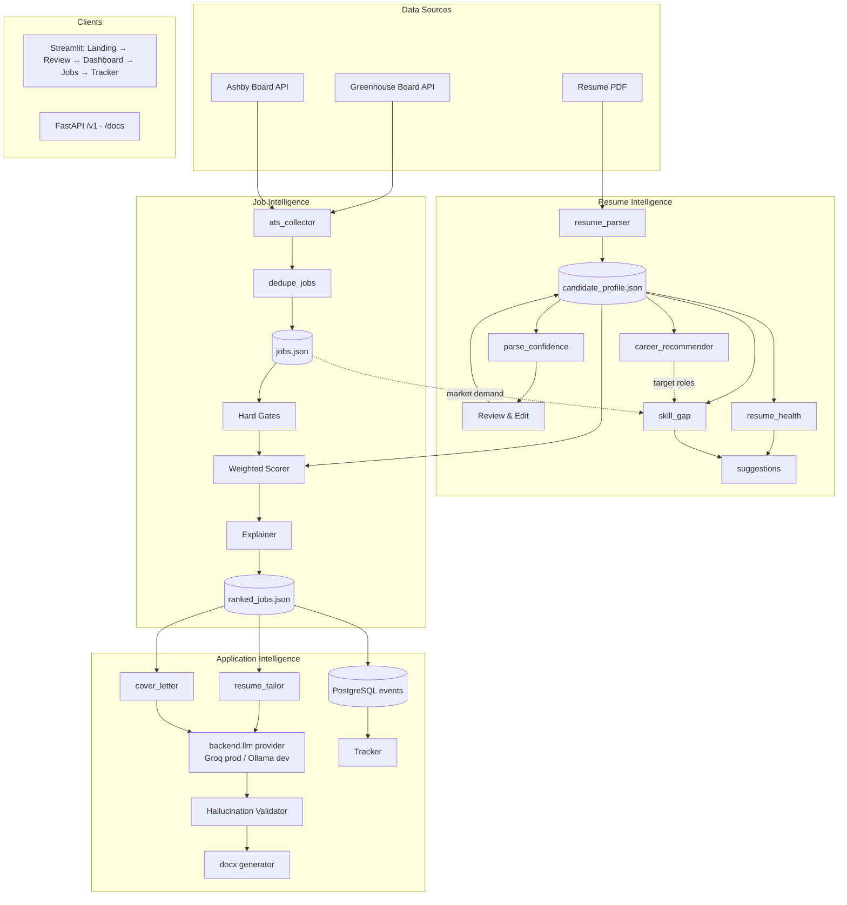
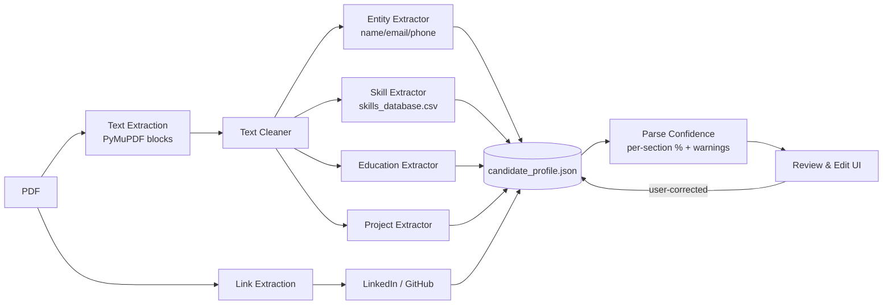
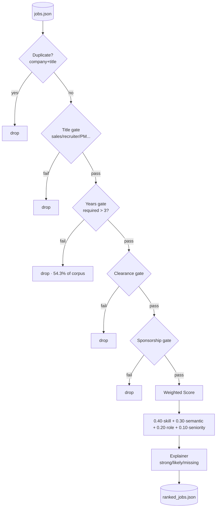
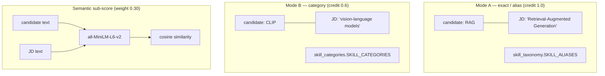
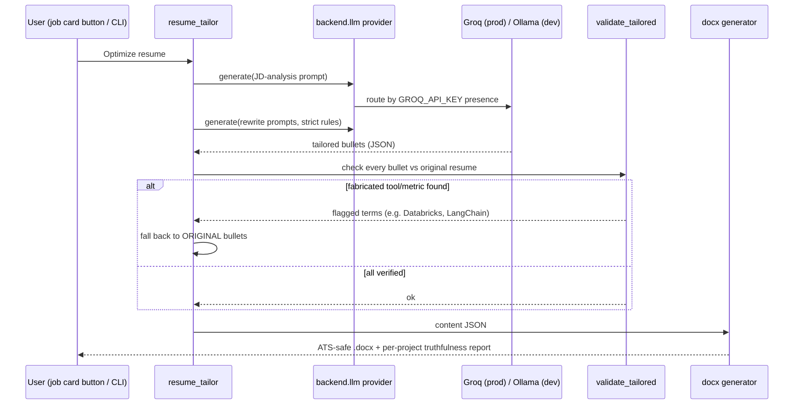
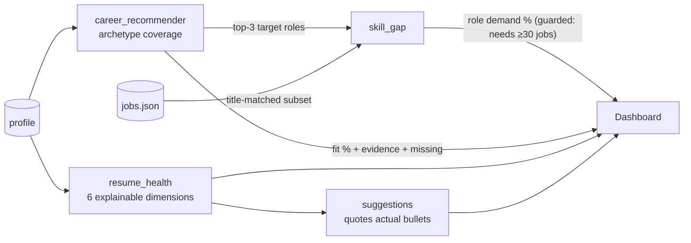
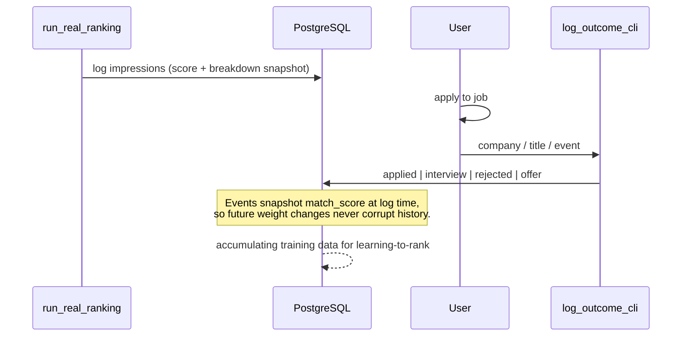
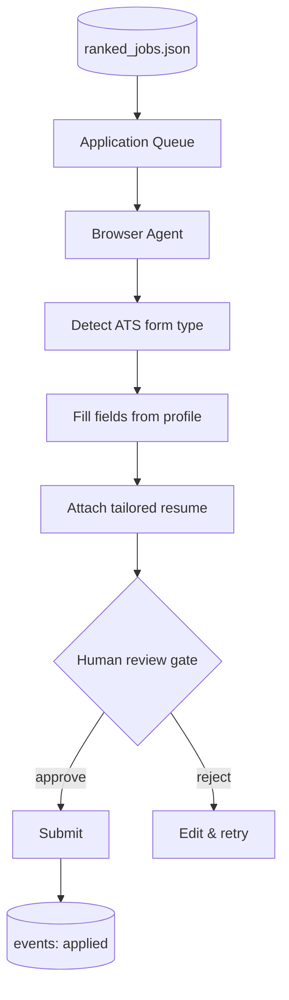
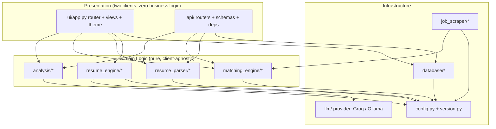

# System Architecture

> All diagrams are Mermaid and render natively on GitHub.

## 1. Complete System Architecture

## 2. Resume Processing Pipeline

## 3. Job Ranking Pipeline

**Design note:** gates *remove*, they never down-rank. A job requiring security clearance is not "a worse match" — it is not an option at all, and pretending otherwise wastes ranked slots.

## 4. Semantic & Skill Matching

Category matches deliberately earn **0.6**, not 1.0: a JD asking for "vision-language models" in general is weaker evidence than one naming CLIP specifically. This asymmetry is documented in `skill_categories.py` and keeps scoring honest.

## 5. Resume Tailoring & Truthfulness

The validator is deterministic (regex + alias table, no LLM) and provider-agnostic: fabrication is *detected* on the output of whichever backend generated it, never just discouraged by prompt.

## 6. Career Intelligence Data Flow

## 7. Application Flow & Events

## 8. Future Auto-Apply Agent (planned)

**Not yet implemented.** The human-review gate is a design commitment, not an afterthought: the agent prepares applications; the human approves them.

## 9. Component Diagram

Dependency rule: **Presentation → Domain → Infrastructure → config. Domain never imports Presentation, and engines never know which LLM provider serves them.** This is why the FastAPI layer was a pure addition, and why swapping Ollama→Groq for deployment touched no business logic.
